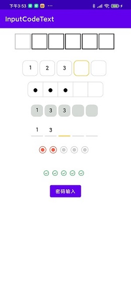
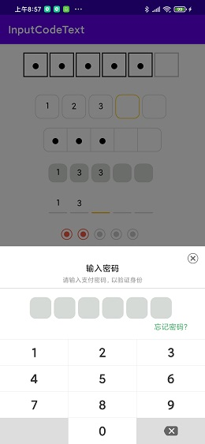

## 演示
                  

## 使用介绍

#### 布局xml
```xml
<?xml version="1.0" encoding="utf-8"?>
    <LinearLayout xmlns:android="http://schemas.android.com/apk/res/android"
        xmlns:app="http://schemas.android.com/apk/res-auto"
        android:layout_width="match_parent"
        android:layout_height="match_parent"
        android:orientation="vertical">
        <com.dzw.inputcode.InputCodeEditText
            android:id="@+id/input_code_1"
            android:layout_width="match_parent"
            android:layout_height="80dp"
            android:background="@color/white"
            android:inputType="number"
            app:tvBorderColor="#151515"
            app:tvFocusBorderColor="#BCBBBA"
            app:tvStrokeWidth="2dp"
            app:tvIntervalSize="5dp"
            app:tvIsPwd="true"
            app:tvLen="6"
            app:tvTextColor="#000000"
            app:tvTextSize="16dp"
            app:tvWidth="45dp" />
    
        <com.dzw.inputcode.InputCodeEditText
            android:id="@+id/input_code_2"
            android:layout_width="match_parent"
            android:layout_height="80dp"
            android:background="@color/white"
            android:inputType="number"
            android:text="123"
            app:tvFocusBorderColor="#FFC107"
            app:radius="10dp"
            app:tvBorderColor="#D6DAD6"
            app:tvIntervalSize="6dp"
            app:tvIsPwd="false"
            app:tvLen="5"
            app:tvStyle="defaultStyle"
            app:tvTextColor="#000000"
            app:tvTextSize="16dp"
            app:tvWidth="45dp" />
    
        <com.dzw.inputcode.InputCodeEditText
            android:id="@+id/input_code_3"
            android:layout_width="match_parent"
            android:layout_height="wrap_content"
            android:background="@color/white"
            android:inputType="number"
            android:text="123"
            app:radius="10dp"
            app:tvBorderColor="#D6DAD6"
            app:tvIntervalSize="0dp"
            app:tvIsPwd="true"
            app:tvLen="5"
            app:tvStyle="startEndRadiusStyle"
            app:tvTextColor="#000000"
            app:tvTextSize="16dp"
            app:tvWidth="45dp" />
    
    
        <com.dzw.inputcode.InputCodeEditText
            android:id="@+id/input_code_4"
            android:layout_width="match_parent"
            android:layout_height="80dp"
            android:background="@color/white"
            android:inputType="number"
            android:text="133"
            app:radius="10dp"
            app:tvBorderColor="#D6DAD6"
            app:tvIntervalSize="6dp"
            app:tvIsPwd="false"
            app:tvLen="5"
            app:tvStyle="weChatPayStyle"
            app:tvTextColor="#000000"
            app:tvTextSize="16dp"
            app:tvWidth="35dp" />
    
        <com.dzw.inputcode.InputCodeEditText
            android:id="@+id/input_code_5"
            android:layout_width="match_parent"
            android:layout_height="wrap_content"
            android:background="@color/white"
            android:inputType="number"
            android:text="13"
            app:tvBorderColor="#D6DAD6"
            app:tvFocusBorderColor="#FFC107"
            app:tvIntervalSize="6dp"
            app:tvIsPwd="false"
            app:tvLen="5"
            app:tvStyle="lineStyle"
            app:tvTextColor="#000000"
            app:tvTextSize="16dp"
            app:tvWidth="35dp" />
    
    
        <com.dzw.inputcode.InputCodeEditText
            android:id="@+id/input_code_6"
            android:layout_width="match_parent"
            android:layout_height="80dp"
            android:background="@color/white"
            android:inputType="number"
            android:text="13"
            app:tvIntervalSize="10dp"
            app:tvLen="5"
            app:tvStyle="customStyle"
            app:tvWidth="35dp" />
    
        <com.dzw.inputcode.InputCodeEditText
            android:id="@+id/input_code_7"
            android:layout_width="match_parent"
            android:layout_height="60dp"
            android:background="@color/white"
            android:inputType="number"
            android:text="13"
            app:tvCustomSelectIcon="@mipmap/adopt_icon_success"
            app:tvIntervalSize="10dp"
            app:tvLen="5"
            app:tvStyle="customStyle"
            app:tvUnCustomSelectIcon="@mipmap/adopt_icon_default"
            app:tvWidth="35dp" />
    
        <Button
            android:id="@+id/click"
            android:layout_width="wrap_content"
            android:layout_gravity="center_horizontal"
            android:layout_height="wrap_content"
            android:onClick="onClickShowDialog"
            android:text="密码输入" />
    </LinearLayout>
```

#### 属性xml
```xml
 <declare-styleable name="CodeEditText">
        <attr name="tvWidth" format="dimension" />
        <!--文字大小-->
        <attr name="tvTextSize" format="dimension" />
        <!--输入个数 默认6个-->
        <attr name="tvLen" format="integer" />
        <!--是否为密码输入框-->
        <attr name="tvIsPwd" format="boolean" />
        <!--间隔-->
        <attr name="tvIntervalSize" format="dimension" />
        <!--圆角-->
        <attr name="radius" format="dimension" />
        <!--文字颜色-->
        <attr name="tvTextColor" format="reference|color" />
        <!--边框颜色-->
        <attr name="tvBorderColor" format="reference|color" />
        <!--边框焦点颜色-->
        <attr name="tvFocusBorderColor" format="reference|color" />
        <!--自定义选中图片-->
        <attr name="tvCustomSelectIcon" format="reference" />
        <!--自定义未选中图片-->
        <attr name="tvUnCustomSelectIcon" format="reference" />
        <!--设置边框粗细-->
        <attr name="tvStrokeWidth" format="dimension" />
        <!--边框样式-->
        <attr name="tvStyle">
            <!--默认无间隔正方形边框(间隔可自己设置通过tvIntervalSize)-->
            <enum name="defaultStyle" value="0" />
            <!--前后圆角边框 此样式不支持焦点颜色设置-->
            <enum name="startEndRadiusStyle" value="1" />
            <!--模拟最新微信支付边框-->
            <enum name="weChatPayStyle" value="2" />
            <!--模拟最新微信支付边框-->
            <enum name="lineStyle" value="3" />
            <!--模拟最新微信支付边框-->
            <enum name="customStyle" value="-1" />
        </attr>
    </declare-styleable>
```
